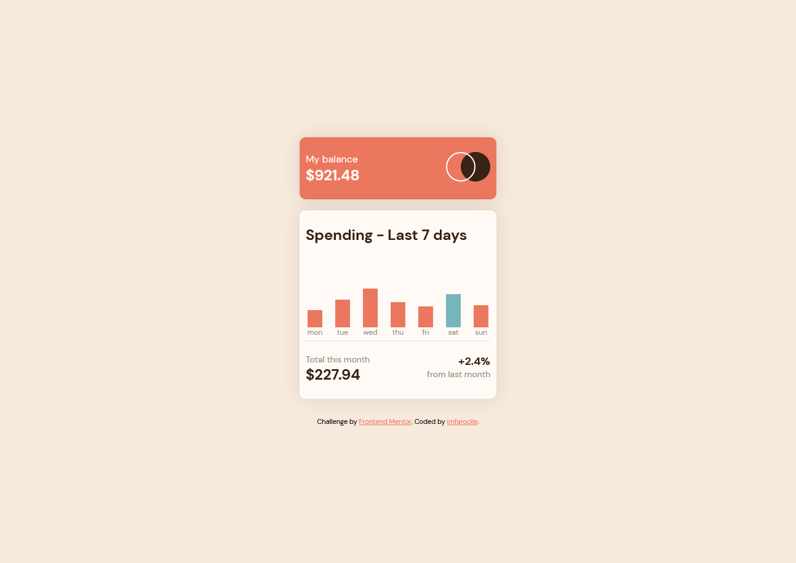
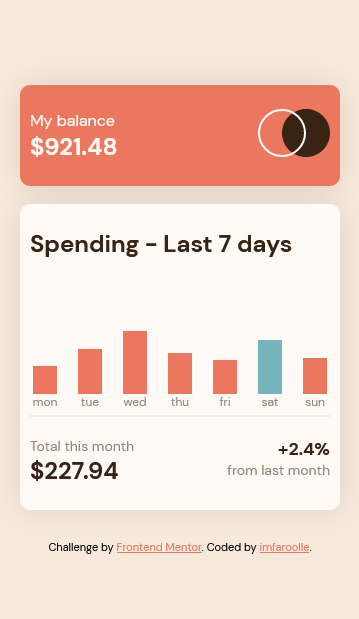

# Expenses chart component solution

This is a solution to the [Expenses chart component challenge on Frontend Mentor](https://www.frontendmentor.io/challenges/expenses-chart-component-e7yJBUdjwt). Frontend Mentor challenges help you improve your coding skills by building realistic projects. 

## Table of contents

- [Overview](#overview)
  - [The challenge](#the-challenge)
  - [Screenshot](#screenshot)
  - [Links](#links)
- [My process](#my-process)
  - [Built with](#built-with)
- [Author](#author)

## Overview

### The challenge

Users should be able to:

- View the bar chart and hover over the individual bars to see the correct amounts for each day
- See the current day’s bar highlighted in a different colour to the other bars
- View the optimal layout for the content depending on their device’s screen size
- See hover states for all interactive elements on the page
- **Bonus**: Use the JSON data file provided to dynamically size the bars on the chart

### Screenshot

#### Desktop

#### Mobile

### Links

- Live Site URL: [imfaroolle Expenses chart component](https://imfaroolle-expenses-chart-component.netlify.app/)

## Built with

- CSS custom properties
- Flexbox
- Mobile-first workflow

## Author

- Website - [imfaroolle](https://www.imfaroolle.com)
- Twitter - [@a_faroole](https://twitter.com/a_faroole)
